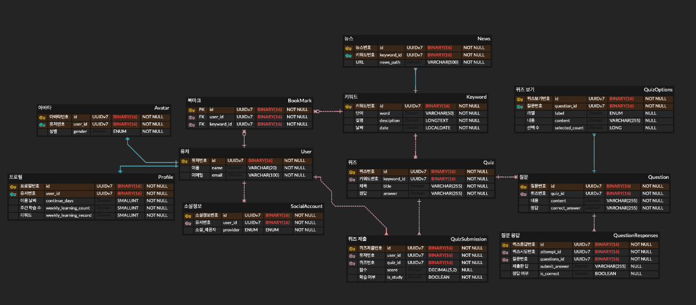
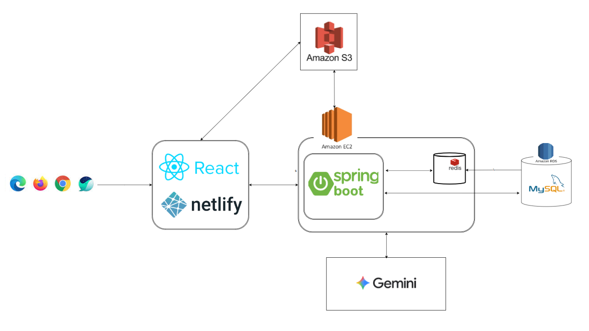

<h1 align="center">ONECO | TAVE-16</h1>
<h3 align="center">하루 10분, 똑똑해지는 경제 습관</h3>

---

## 목차
- [프로젝트 소개](#프로젝트-소개)
- [기술 스택](#기술-스택)
- [전체 아키텍처 구조](#전체-아키텍처-구조)
- [ERD 구조](#erd-구조)
- [아키텍처 상세 설명](#아키텍처-상세-설명)
  - [1. [아키텍처] 최소 1회 전송(At-least-once)을 보장하는 알림 시스템](#1-아키텍처-최소-1회-전송at-least-once을-보장하는-알림-시스템)

---

## 프로젝트 소개
**OneCo(원코)** 는 ‘One Day, One Economy’의 줄임말로,
하루에 하나씩 경제 키워드를 배우며 경제 감각을 키우는 학습 서비스입니다.
뉴스나 교과서 대신, 이해하기 쉬운 AI 설명과 퀴즈로 구성된 콘텐츠를 매일 10분씩 제공하여,
누구나 가볍게 경제를 이해하고 자신의 생각을 확장할 수 있도록 돕습니다.

---

## 주요 기능
1. 오늘의 경제 키워드와 관련 뉴스를 매일 원하는 시간에 푸시 알림으로 제공
2. AI가 쉽게 설명해주는 경제 개념 학습 콘텐츠 제공
3. 퀴즈를 통한 학습 효과 극대화 및 복습 기능 제공

---

## 기술 스택

  
  

---

## ERD 구조

---

## 전체 아키텍처 구조

---

## 아키텍처 상세 설명
### [[아키텍처] 최소 1회 전송(At-least-once)을 보장하는 알림 시스템](docs/Notification_System_Architecture.md)

