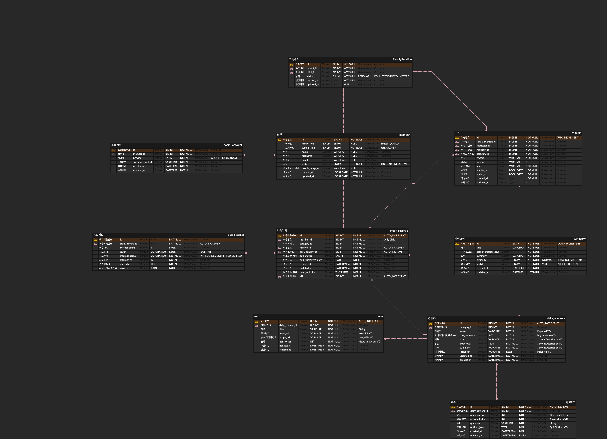
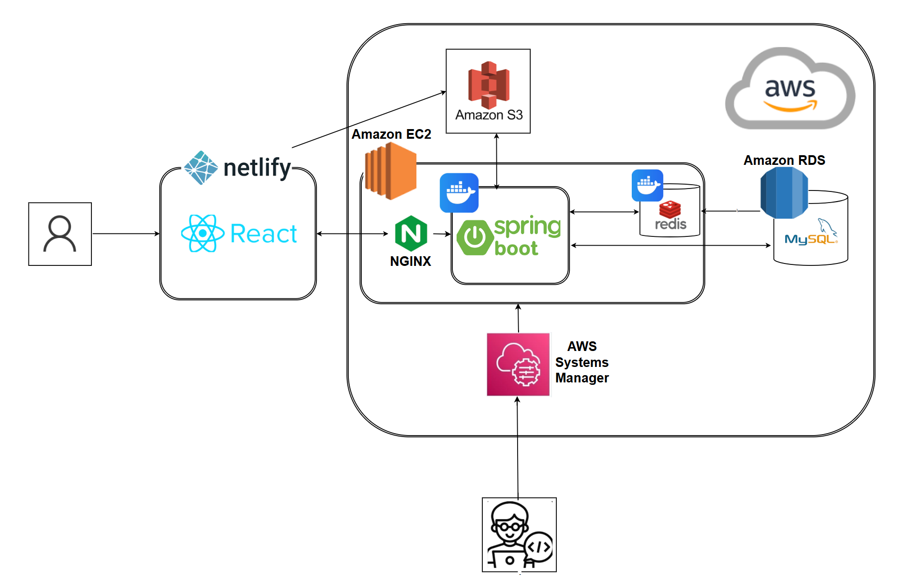
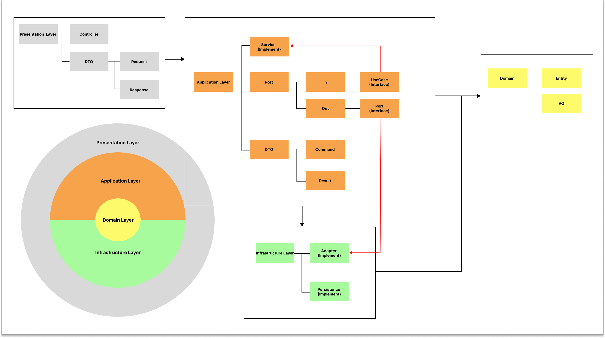
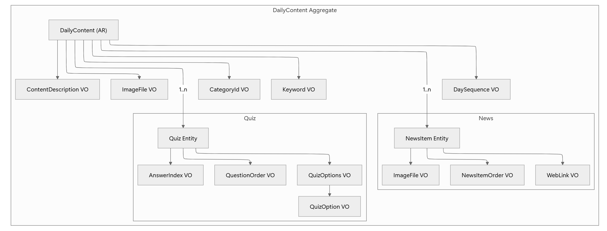
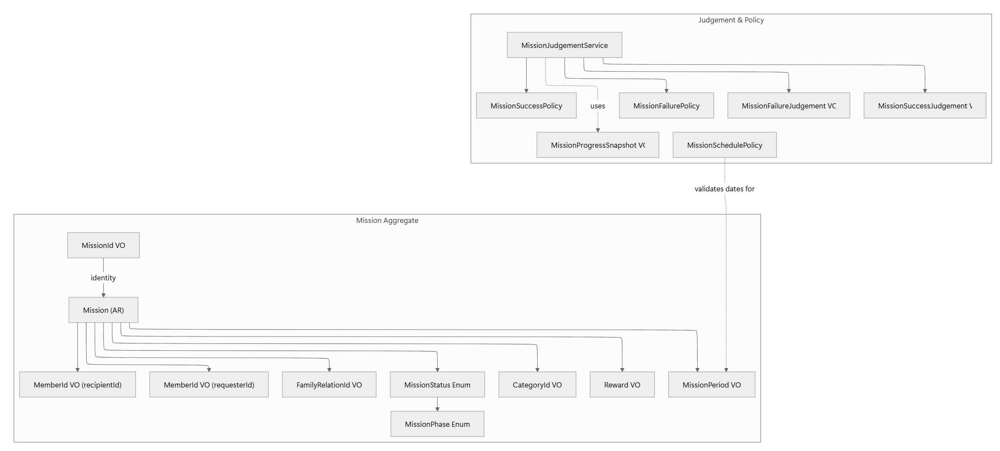
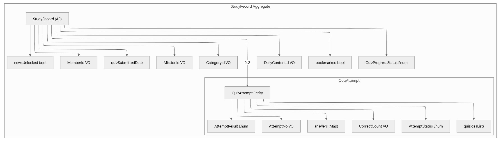
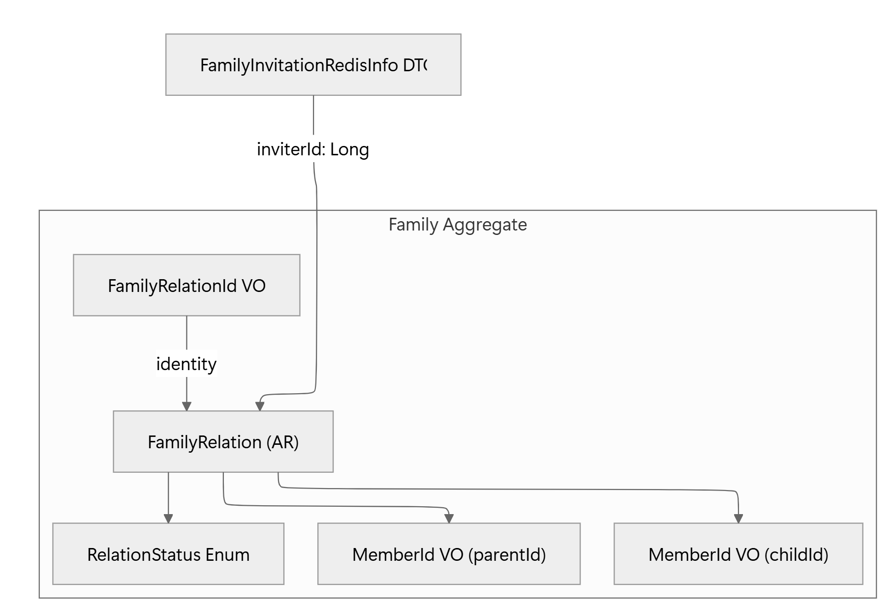
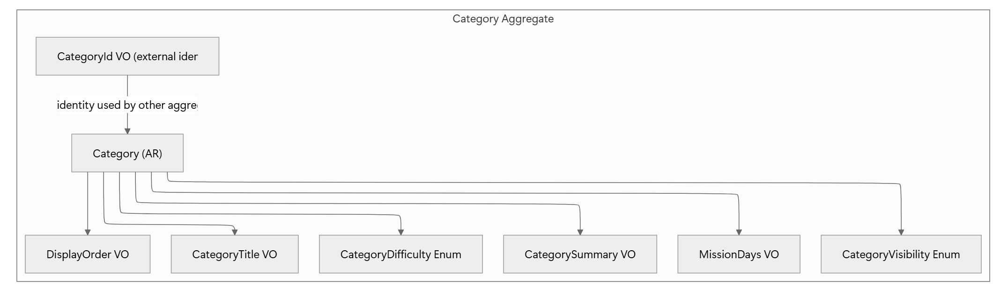
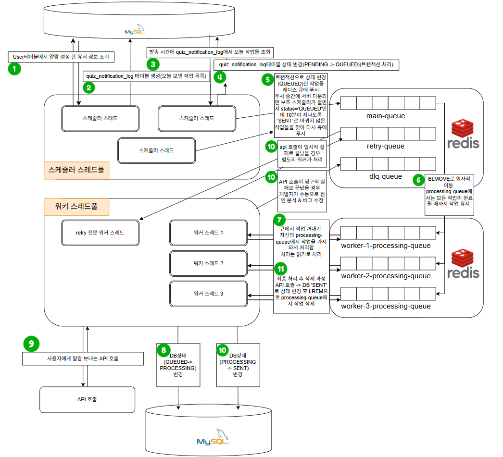

<h1 align="center">ONECO_v1</h1>

  

<h3 align="center">부모-자녀 페어링 기반 경제·금융 키워드 교육 서비스</h3>

    <a href="https://oneco.io.kr/"> 원코 바로가기 </a>

---

## 💿 ERD 설계

---

## ⚙️ 인프라 아키텍처 

[단일 EC2에서 운영하기: 컨테이너 분리와 SSH→SSM 전환 개발 스토리 보러가기](https://goodjunseon-tech-blog.tistory.com/12)

## 🔁 소프트웨어 아키텍처

## 🚀 도메인 아키텍처

### DailyContent 도메인

[DailyContent 도메인 개발 스토리 보러가기](https://gimini.tistory.com/46)

### Mission 도메인

[Mission 도메인 개발 스토리 보러가기]

### StudyRecord 도메인

[StudyRecord 도메인 개발 스토리 보러가기]

### Family 도메인

[Family 도메인 개발 스토리 보러가기]

### Category 도메인

[Category 도메인 개발 스토리 보러가기]

---

## 시스템 아키텍처 [구현 예정]
### 최소 1회 전송(At-least-once)을 보장하는 알림 시스템

[누락 없이 알림을 보내기 위한 Redis 큐 & 워커 설계 보러가기 ](https://gimini.tistory.com/60)

